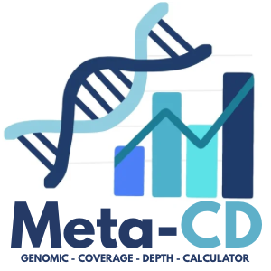
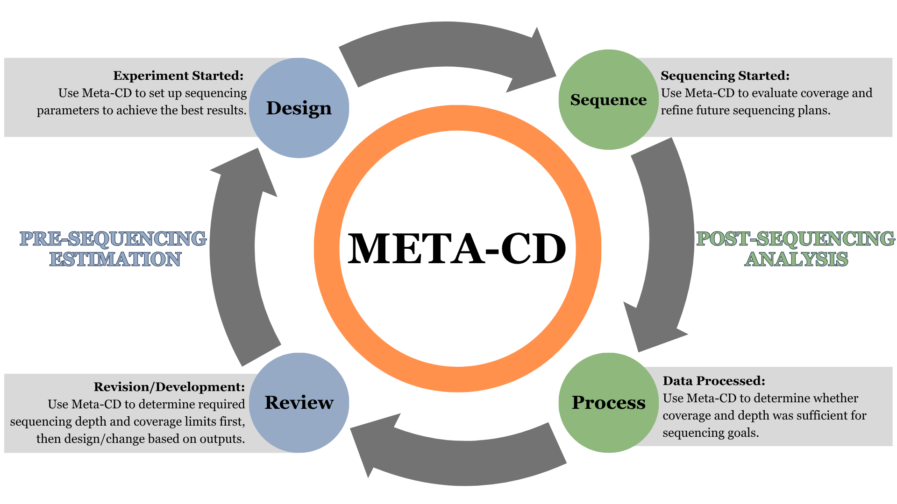

<div style="text-align:center; margin-top:20px;">
  
</div>

# Meta‑CD  
Written by Callie Claiborne (cysteger@ncsu.edu), PhD student in Bioinformatics, from the Lyu Lab, Department of Plant and Microbial Biology, North Carolina State University

<a href="https://doi.org/10.5281/zenodo.21936365"></a>

**Live Tool:** https://cysteger.github.io/Meta-CD/  
**Repository:** https://github.com/cysteger/Meta-CD


<h2>Description</h2>

<p>
Accurately determining whether a target microbial species can be detected in a shotgun metagenomic
sequencing study requires understanding how biological and sequencing parameters interact (1–3).
Meta‑CD determines coverage and depth for targeted metagenomic applications where the abundance of the
organism of interest is known, estimated, or experimentally controlled, including enrichment cultures,
selective growth conditions, and mock communities where species‑specific coverage predictions are
biologically meaningful. In these settings, genome size and relative abundance shape the biological
context, while sequencing depth and DNA input constrain the number of unique molecules available;
however, this interaction is poorly modeled, hindering biologically motivated experimental design and
sequencing analysis (2–4). Consequently, researchers lack a simple way to assess detectability of a
target species under biologically relevant sequencing constraints (2,5), and additional parameters must
be integrated to inform functional pathway analysis and MAG recovery (6).
</p>

<p>
Meta‑CD addresses this gap by integrating biological and sequencing parameters to support two primary
use cases: (1) pre‑sequencing estimation of required sequencing depth to reach a target coverage
threshold, and (2) post‑sequencing analysis of species‑specific coverage given sequencing depth and
relative abundance. Users may utilize Meta‑CD at any stage of a metagenomic study to refine
experimental planning or evaluate sequencing outcomes.
</p>

<ol>
  <li><strong>Pre‑Sequencing Estimation</strong> — determining the sequencing depth required to reach a target coverage threshold.</li>
  <li><strong>Post‑Sequencing Analysis</strong> — estimating species‑specific coverage given sequencing depth and abundance.</li>
</ol>

<h2>Workflow Overview</h2>

<p>
The workflow supported by Meta-CD is illustrated in Figure 1, outlining how users may utilize Meta-CD at any stage of a metagenomic study to refine experimental planning or evaluate sequencing outcomes.
</p>

<div align="center">
  
  <h3>Figure 1. Meta‑CD Integration into Metagenomic Study</h3>
  <p>Meta‑CD supports both pre‑sequencing planning and post‑sequencing evaluation. Users may enter the cycle at any stage (Design, Sequence, Analyze, Review).</p>
</div>

<p>
Meta-CD implements a deterministic model and integrates user-defined biological and sequencing parameters: relative abundance, genome size, sequencing depth, and DNA input quantity, to estimate species-specific coverage (1,2,4,7). It calculates the expected number of sequencing bases originating from a species and converts this into per-base coverage (1,3,7). When nominal sequencing depth exceeds the number of unique DNA base pairs available in a sample, Meta-CD applies a DNA‑quantity‑constrained correction to ensure coverage estimates remain biologically relevant (3,4,8,9). Users may select coverage thresholds from 1×–30× to support applications ranging from genome-level taxonomic detection and functional profiling to high-confidence variant calling for MAG recovery (2,6).
</p>

<p>
Meta‑CD is available as a browser-based application using HTML, CSS, and JavaScript. All computations occur locally in the user’s browser. The interface provides real‑time updates, interactive input fields, and two visual reference components: a MAG Recovery Potential Table and a Coverage Estimation Table summarizing expected coverage across sequencing depth and relative abundance. The full source code is publicly available with version control, documentation, a permissive license, and an issue tracker. No registration is required, and the tool does not rely on external datasets.
</p>

<p>
All calculations performed by Meta‑CD follow the mathematical framework summarized in Table 1, outlining how sequencing depth, relative abundance, genome size, and DNA quantity are integrated to generate each output (1,7,8). These equations form the basis of all values reported by the tool and ensure transparent, reproducible interpretation of species‑level coverage estimates (3). The results have been validated using the MBARC‑26 mock community, a defined mixture of 26 bacteria and archaea genomes with known genome sizes, molarity, genome copy numbers, and sequencing representation (10).
</p>

### Table 1. Summary of Calculations Implemented in Meta‑CD

| Output                                   | Formula / Calculation                                   | Description                                                                                                                       | Ref        |
|------------------------------------------|---------------------------------------------------------|-----------------------------------------------------------------------------------------------------------------------------------|-----------|
| D<sub>community</sub> (Base conversion)             | D<sub>community</sub> (bases) = D<sub>community</sub> (Gb) × 10<sup>9</sup>            | Total sequencing depth converted from gigabases to bases.                                                                        | (7)        |
| Maximum Unique Depth (DNA-limited)       | D<sub>max</sub> = DNA<sub>ng</sub>                                           | Approximation that 1 ng DNA yields ~1 Gbp of unique sequence.                                                                    | (4,8)      |
| Species‑Specific Sequencing Bases        | B<sub>species</sub> = D<sub>community</sub> × 10<sup>9</sup> × A                       | Total number of DNA bases sequenced from target species. Sequencing depth (in Gb) is converted to bases and multiplied by relative abundance. | (3,7)      |
| Coverage From Sequencing Depth           | C = (D<sub>effective</sub> × 1000 × A) / G                       | Expected average coverage for a genome of size G at abundance A, using effective depth adjusted for DNA‑input constraint.        | (7,11)     |
| Effective Sequencing Depth (DNA-Limited) | D<sub>effective</sub> = min(D<sub>total</sub>, D<sub>max</sub>)                      | If DNA input constrains library complexity, the effective depth is capped at D<sub>max</sub> (1 ng ≈ 1 Gb DNA base pairs).                  | (4,8)      |
| Required Sequencing Depth                | D<sub>required</sub> = (C<sub>target</sub> × G) / (1000 × A)               | Sequencing depth needed to reach target coverage for a species at a given relative abundance.                                    | (3,7,11)   |
| Minimum Detectable Relative Abundance    | A<sub>min</sub> = (C<sub>target</sub> × G) / (1000 × D<sub>effective</sub>)          | Lowest relative abundance at which the species reaches the target coverage under the available effective depth.                  | (3,7,11)   |
| Naive Coverage (No DNA Limit)            | C<sub>naive</sub> = (D<sub>total</sub> × 1000 × A) / G                     | Coverage assuming unlimited DNA input.                                                                                            | (3,7)      |
| MAG Recovery Coverage                    | C = (D<sub>effective</sub> × 1000 × A) / G                       | Same formula as coverage; interpreted using MAG thresholds (1×, 5×, 10×, 20×).                                                   | (6,12)     |
| Coverage Estimation Table Values         | Computed using C<sub>effective</sub> across depth × abundance    | Table shows expected coverage for the pre‑computed matrix automatically adjusted for genome size and DNA quantity.              | (7,8,10)   |

<p><strong>Table 1. Explanation of calculations performed by Meta-CD.</strong> Mathematical calculations used in Meta‑CD to compute species‑specific sequencing bases, coverage, detection limits, and required sequencing depth. VVariables are defined as follows: D<sub>community</sub> (total sequencing depth, Gb), D<sub>effective</sub> (effective sequencing depth adjusted for DNA‑input constraints), D<sub>max</sub> (maximum sequencing depth constrained by DNA quantity), G (genome size, Mb), A (relative abundance as a fraction),  
A<sub>min</sub> (minimum relative abundance required to reach target coverage), C (coverage), C<sub>target</sub> (user‑defined target coverage), B<sub>species</sub> (bases sequenced from the target species), C<sub>effective</sub> (effective coverage adjusted for DNA‑input constraint). All calculations follow the standard metagenomic coverage equation and incorporate DNA‑quantity constraints where applicable.</p>

<p>
Meta-CD predicts the required sequencing depth for a given experimental design (pre-sequencing estimation) and the likelihood of performing taxonomic detection, functional profiling, and MAG recovery for a given metagenomic dataset (post-sequencing analysis). Meta-CD enables quantitative, biologically informed decisions throughout the cycle of metagenomic studies.
</p>

## Naive vs DNA‑Limited Outputs in Meta‑CD

Meta‑CD reports both naive (total‑depth) and DNA‑limited (effective‑depth) values for all coverage‑related calculations:

- Bases sequenced  
- Coverage  
- Minimum detectable relative abundance  

Naive values assume unlimited DNA input and use the full sequencing depth.  
DNA‑limited values apply a library‑complexity constraint based on DNA quantity, using:

D<sub>effective</sub> = min(D<sub>total</sub>, D<sub>max</sub>)

where D<sub>max</sub> is derived from DNA mass (1 ng ≈ 1 Gbp unique sequence).

This dual‑mode output allows users to evaluate both ideal sequencing performance and realistic DNA‑limited constraints, and is fully reflected in the MBARC‑26 validation dataset.


# How Meta‑CD Works

## 1. Pre‑Sequencing Estimation
Given the desired coverage of a target species, the tool estimates:

- Required sequencing depth  
- Minimum detectable relative abundance  
- Adjusted detection thresholds by genome size and DNA quantity  

## 2. Post‑Sequencing Analysis
Given the total sequencing depth and relative abundance of a target species, the tool calculates:

- Total bases sequenced for the species  
- Achieved coverage, adjusted by genome size and DNA quantity  
- MAG recovery potential  

## 3. Coverage Estimation Table
A pre-generated depth × abundance matrix to help users quickly evaluate:

- Feasibility of taxonomic profiling  
- Functional profiling thresholds  
- Rare taxon/gene detection  
- MAG recovery likelihood  


# How To Use Meta-CD

Meta‑CD is live, free to use, and is available at:

**https://cysteger.github.io/Meta-CD/**

This web-based tool requires no installation or registration to use.


# Running Meta‑CD Locally

To run the tool locally:


```bash
git clone https://github.com/cysteger/Meta-CD
cd Meta-CD
```


# Validation Test Suite (MBARC‑26)

Meta‑CD includes a fully reproducible validation suite based on the **MBARC‑26 mock community**, a defined mixture of 26 microbial genomes from both bacteria and archaea with known genome sizes, molarity, genome copy numbers, and sequencing representation. This dataset was published by Singer et al. (2016) as a benchmark for evaluating metagenomic sequencing and analysis tools.

The MBARC‑26 test suite allows users to verify that Meta‑CD’s calculations match experimentally measured sequencing outcomes.

## What the test suite contains

The directory [`tests/`](tests/) includes:

### **1. `mbarc26_expected_outcomes.csv`**
A machine‑generated table containing the **expected numeric outputs** for all 26 MBARC‑26 organisms, including:

- Genome size (bp, Mb)  
- Relative abundance (%)  
- Sequencing depth (155.8 Gb)  
- Bases sequenced (naive and DNA‑limited)  
- Achieved coverage (naive and DNA‑limited)  
- Required depth for 5×  
- Minimum detectable relative abundance (naive and DNA‑limited)  
- DNA mass (ng)  
- Effective depth (Gb)  

These values were computed using the exact formulas implemented in Meta‑CD.

### **2. `generate_mbarc26_expected_outcomes_csv.py`**
A fully reproducible Python script that regenerates the expected‑outcomes CSV from:

- Genome sizes (Table 1 of Singer et al.)  
- Illumina % mapped genome (Supplementary Table 1)  
- Genome copies per µL (Supplementary Table 1)  
- Sequencing depth (Table 2)  

This ensures the test suite is transparent, auditable, and scientifically defensible.

### **3. `mbarc26_inputs.csv`**
A simplified input table containing the raw biological and sequencing parameters used by the Python script to generate the expected outcomes. These values include:

- Species name  
- Genome size (bp, Mb)  
- Relative abundance (baseline 1%)  
- Sequencing depth (155.8 Gb)  
- Sequencing platform (Illumina)  

This file is read directly by the validation script and serves as the input layer for generating all naive and DNA‑limited expected values.

### **4. `README_tests.md`**
Documentation describing:

- The formulas used  
- How each expected value is computed  
- How naive and DNA‑limited outputs differ  
- How to validate Meta‑CD against the MBARC‑26 dataset  

## How to use the test suite

1. Open Meta‑CD (web or local).  
2. Select any organism from the MBARC‑26 dataset.  
3. Enter the values from `mbarc26_expected_outcomes.csv`:  
   - Genome size  
   - Relative abundance  
   - Sequencing depth  
   - DNA quantity (optional)  
4. Compare Meta‑CD’s outputs to the expected values in the CSV.

Meta‑CD should match the expected values within rounding error.

This provides formal validation for users.


<h2>References</h2>

<ol>
  <li>
    Nayfach S, Pollard KS. Average genome size estimation improves comparative metagenomics and sheds light on the functional ecology of the human microbiome. 
    <em>Genome Biol.</em> 2015 Mar 25;16(1):51. doi:10.1186/s13059-015-0611-7
  </li>

  <li>
    Treichel NS, Pauvert C, Séneca J, Pjevac P, Berry D, Penders J, et al. Benchmarking of shotgun sequencing depth reveals the potential and limitations of shallow metagenomics and strain-level analysis. 
    <em>Nat Microbiol.</em> 2026 May;11(5):1233–44. doi:10.1038/s41564-026-02334-2
  </li>

  <li>
    Nayfach S, Pollard KS. Toward Accurate and Quantitative Comparative Metagenomics. 
    <em>Cell.</em> 2016 Aug 25;166(5):1103–16. doi:10.1016/j.cell.2016.08.007
  </li>

  <li>
    Daley T, Smith AD. Predicting the molecular complexity of sequencing libraries. 
    <em>Nat Methods.</em> 2013 Apr;10(4):325–7. doi:10.1038/nmeth.2375
  </li>

  <li>
    Tremblay J, Schreiber L, Greer CW. High-resolution shotgun metagenomics: the more data, the better? 
    <em>Brief Bioinform.</em> 2022 Nov 19;23(6):bbac443. doi:10.1093/bib/bbac443
  </li>

  <li>
    Parks DH, Rinke C, Chuvochina M, Chaumeil PA, Woodcroft BJ, Evans PN, et al. Recovery of nearly 8,000 metagenome-assembled genomes substantially expands the tree of life. 
    <em>Nat Microbiol.</em> 2017 Nov;2(11):1533–42. doi:10.1038/s41564-017-0012-7
  </li>

  <li>
    Lander ES, Waterman MS. Genomic mapping by fingerprinting random clones: A mathematical analysis. 
    <em>Genomics.</em> 1988 Apr;2(3):231–9. doi:10.1016/0888-7543(88)90007-9
  </li>

  <li>
    McNulty SN, Mann PR, Robinson JA, Duncavage EJ, Pfeifer JD. Impact of Reducing DNA Input on Next-Generation Sequencing Library Complexity and Variant Detection. 
    <em>J Mol Diagn.</em> 2020 May;22(5):720–7. doi:10.1016/j.jmoldx.2020.02.003
  </li>

  <li>
    Deng C, Daley T, Calabrese P, Ren J, Smith AD. Predicting the Number of Bases to Attain Sufficient Coverage in High-Throughput Sequencing Experiments. 
    <em>J Comput Biol.</em> 2020 Jul 1;27(7):1130–43. doi:10.1089/cmb.2019.0264
  </li>

  <li>
    Singer E, Andreopoulos B, Bowers RM, Lee J, Deshpande S, Chiniquy J, et al. Next generation sequencing data of a defined microbial mock community. 
    <em>Sci Data.</em> 2016 Sep 27;3(1):160081. doi:10.1038/sdata.2016.81
  </li>

  <li>
    Wendl MC, Kota K, Weinstock GM, Mitreva M. Coverage theories for metagenomic DNA sequencing based on a generalization of Stevens’ theorem. 
    <em>J Math Biol.</em> 2013 Nov 1;67(5):1141–61. doi:10.1007/s00285-012-0586-x
  </li>

  <li>
    Alneberg J, Bjarnason BS, de Bruijn I, Schirmer M, Quick J, Ijaz UZ, et al. Binning metagenomic contigs by coverage and composition. 
    <em>Nat Methods.</em> 2014 Nov;11(11):1144–6. doi:10.1038/nmeth.3103
  </li>
</ol>

